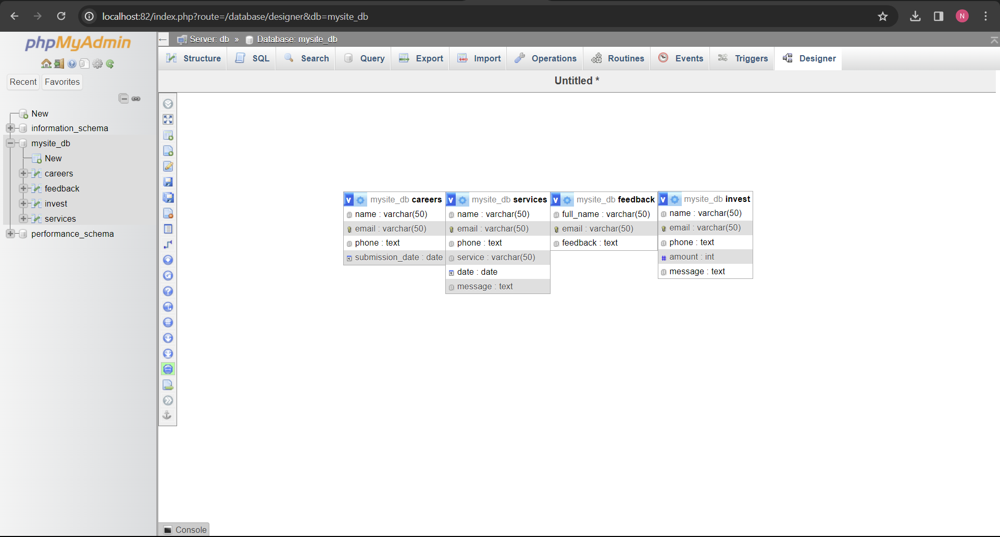

# PTK Cleaning - Team 27

PTK Cleaning: Offering top-notch cleaning services and job opportunities on one user-friendly website.

## Table of Contents
- [Features](#features)
- [Database Tables](#database-tables)
- [Created Forms](#created-forms)
- [Created Tables](#created-tables)

---

## Features

In this section, list and describe the features or functionality that you are working on. You can use checkboxes to track the progress of each feature.

- [ ] Feature 1 (Gurpreet Singh): Booking. 
- [ ] Feature 2 (Manpreet Kaur): Applying for Job with Us.
- [ ] Feature 3 (Nikhil): Feedback/Suggestion.
- [ ] Feature 4 (Farhana): Investors.

### Booking

Users can easily select their desired service, specify the date and time and Drop a Personalised messages for more Specific Service. [Github - Gurpreet](https://github.com/manukatnoria/Team27-WebProject/blob/main/Gurpreet-booking.php) & link to the feature (shell.hamk.fi) .

### Applying for Job with Us

Users can effortlessly, submit their applications by just giving their Name, Email and Phone Number. [Github - Manpreet](https://github.com/manukatnoria/Team27-WebProject/blob/main/Manpreet-job.php) & [Shell - Manpreet23000](http://shell.hamk.fi/~manpreet23000/Team27-WebProject/) .

### Feedback/Suggestion

We value our user's input! Share your thoughts and suggestions with us, Whether you have ideas for enhancing our cleaning services/offerings or suggestions for optimizing our website, so just put your name and your email followed by a large Space for you to share your every Thought. [Github - Nikhil](https://github.com/manukatnoria/Team27-WebProject/blob/main/Nikhil-feedback.php) & [Shell - Nikhil23001](http://shell.hamk.fi/~nikhil23001/Project%20work/Team27-WebProject/) .

### Investors

Explore investment opportunities with PTK Cleaning and become a part of our journey towards innovation and growth, Just Enter your Details and we will make All the Arrangements on Email. [Github - Farhana](https://github.com/manukatnoria/Team27-WebProject/blob/main/Farhana-investor.php) & link to the feature (shell.hamk.fi) .

---

## Database Tables

List the database tables that are part of your project. 

- Table 1 (Created By Gurpreet Singh):    services
- Table 2 (Created By Manpreet):          careers 
- Table 3 (Created By Nikhil):            feedback
- Table 4 (Created By Farhana):           invest
> Include the ER Diagram of the database.

---

## Created Forms

List and describe any forms that have been created as part of your project.

- Form 1 (Created By Gurpreet): Booking Services: [Github - Gurpreet](https://github.com/manukatnoria/Team27-WebProject/blob/main/Gurpreet-booking.php) | Link to the form (shell.hamk.fi).
- Form 2: (Created By Manpreet): Apply-for-job: [Github - Manpreet](https://github.com/manukatnoria/Team27-WebProject/blob/main/Manpreet-job.php) | [Shell - Manpreet23000](http://shell.hamk.fi/~manpreet23000/Team27-WebProject/Manpreet-job.php).
- Form 3: (Created By Nikhil): Feedback/Suggestion: [Github - Nikhil](https://github.com/manukatnoria/Team27-WebProject/blob/main/Nikhil-feedback.php) | [Shell - Nikhil23001](http://shell.hamk.fi/~nikhil23001/Project%20work/Team27-WebProject/Nikhil-feedback.php).
- Form 4: (Created By Farhana): Invest in Us: Link to the related code file (github) | Link to the form (shell.hamk.fi).

---
